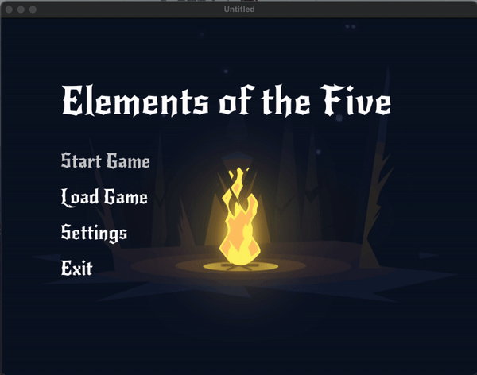

# game_menu

This is the main menu of the game, showcasing the title and interactive options such as **Start Game**, **Load Game**, **Settings**, and **Exit**. The menu is animated to give a lively experience for the player.

### Menu Animation

The animation below demonstrates the interactive elements of the menu. The user can select a game option by navigating through the menu.

